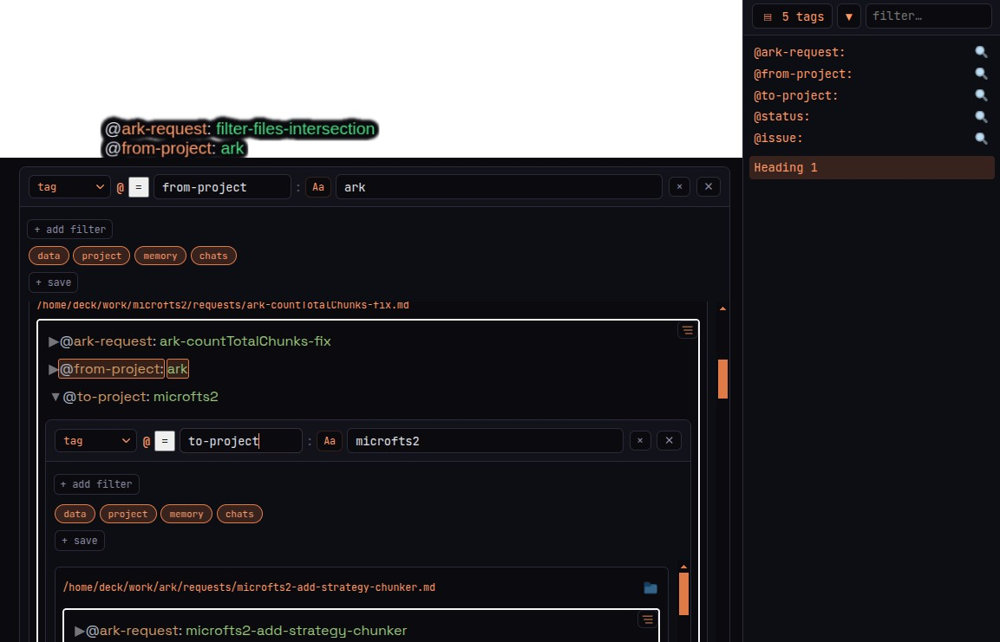
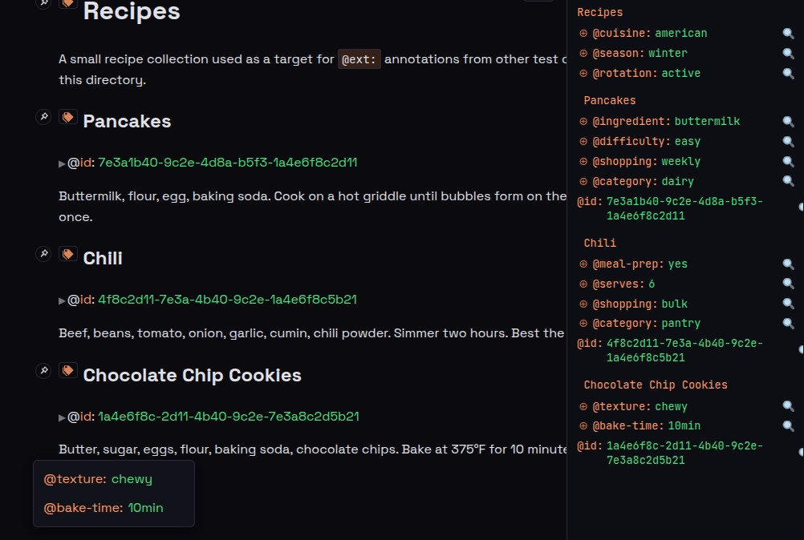

# Ark Tags

Ark tags are how you connect ideas across your files. They live inside
the files themselves, they connect groups of files rather than
pointing from one file to another, and their values participate in
ranking — turning binary set membership into a continuous
gradient. The result is a kind of connection structure that paper
zettelkastens couldn't build and most digital zettelkastens don't.

This document is the operational explainer: what an ark tag *is*,
what you can *do* with one, what makes the resulting structure
different from a notebook, and where the system is going. For the
basic install-and-go story see [README.md](README.md); for the
project-level commitments that constrain everything below see
[principles.md](principles.md).

@note: make ark tags an open standard -- Ark is a reference implementation; include ark tag applications: scheduling (with syntax), ark messages, link/id, ext tags

---

## What an ark tag is

An ark tag is `@name: value`, where the value runs to the end of
the line. The `@` must be at the start of a line or preceded by a
space — anything else (an email address, a code identifier with
`@` in it) is treated as text. Tags inside backtick or
double-quote pairs are treated as mentions (someone discussing a
tag, not using it) and aren't indexed. In markdown files, tags
inside fenced code blocks or indented code blocks are also
skipped.

```
@decision: use LMDB for the index
@status: open
@pattern: closure-actor
```

Ark indexes files by *chunking* them — splitting each file into
searchable pieces. For markdown, a chunk is a paragraph; a
heading includes the content under it down to the next heading.
For code, a chunk is a top-level definition together with its
preceding comments. Tags are tracked per chunk; a tag *inside*
a chunk is *about* that chunk by default.

Tags can appear anywhere in a file. Multiple tags per chunk are
fine; multiple tags per line are also fine (compound tags — see
*Attachment* below). Every tag ark sees gets indexed, both by
name and by value.

A tag has three structural properties, and each one does
something that ordinary tags in other systems don't do.

**Name.** The name picks the hyperedge. `@decision:` is one
hyperedge; `@status:` is another; `@pattern:` is another. Every
file carrying `@decision:` is a member of the decisions
hyperedge — not because anyone said so pairwise, but because the
tag connects them as a *set*. The hypergraph emerges from the
tags, not the other way around.

**Value.** The value attenuates membership within the hyperedge.
Two files both carry `@decision:` — one says `@decision: use LMDB
for index storage`, the other `@decision: defer the auth
rewrite`. Both belong to the set; their values give them
position within it. A search for `LMDB` against the decisions
hyperedge ranks the first chunk near the top because the value
participates in scoring, not just the name. Tag values are
full-text searchable; membership is a continuous gradient, not a
binary flag.

**Attachment.** The tag's *physical* location can differ from
its *logical* target. A tag within a chunk is *about* its chunk
by default — the inline mode. But `@ext:` lets a tag in *one* file
attach to a chunk in *another* file by locator, so the tag's
truth lives over there even though the writing is over here.
This is the compound-tag mechanic, and it's what makes ark a
substrate for community curation: you can tag content you don't
own.

For the basic syntax also see the *What Is a Tag* section in
[README.md](README.md). The rest of this document focuses on what
those three properties *enable*.

A fourth property — the *kind* of relationship between a tag and
its chunk (about / connection / idea / to-do / question / ...) —
is currently being designed. The bare syntax can't tell you
whether `@todo: rewrite spec` describes the chunk's subject or
records an action item; **tag axes** put that structure back.
The working notes live at
[.scratch/TAG-AXES.md](.scratch/TAG-AXES.md); when the design
settles, the canonical material moves into this document.

---

## The three orders of connection

Most knowledge systems offer one or two ways to connect ideas.
Ark offers three (and a fourth that falls out of composition).

### First-order: pairwise links

This is the form Vannevar Bush named, Ted Nelson built into
Xanadu, Ward Cunningham put in WikiWikiWeb, and every wiki-style
tool has used since: *this points at that*. A link is named at
the source, single-pointer, directional.

In ark, this looks like:

```
@id: design-overview
@link: design-overview        # planned: clickable hyperlinks via the markdown viewer
```

`@id:` declares a stable identifier for a chunk; it's shipped
today, and it's how `@ext:` references survive edits to a
chunk's surrounding text. `@link:` is the planned hypertext
companion — when present, the markdown viewer will render it as
a clickable `<a href="/content/...">` so a reader can navigate.

### Second-order: tag-set membership

Multiple files carry the same tag name. Together they form a
hyperedge — a relationship that binds N members at once.

```
fileA.md:  @pattern: closure-actor
fileB.md:  @pattern: closure-actor
fileC.md:  @pattern: closure-actor
```

The connection between A, B, and C isn't *stated anywhere
pairwise*. It exists because they share the tag. Indexes can
discover it; readers can query for it. This is what tag-based
notebooks (Obsidian, LogSeq, Notion) have done for years.

Membership at this level is binary: you're in the set or you
aren't.

### Third-order: spectral attenuation

This is where ark goes beyond what other tag systems offer.

```
fileA.md:  @decision: use LMDB for the chunk index
fileB.md:  @decision: defer the auth rewrite
fileC.md:  @decision: switch chunker from line-based to bracket
```

All three are members of the `@decision:` hyperedge. But the
values say something specific. A query for `LMDB` against the
`@decision:` hyperedge gives an *ordering* — fileA ranks closer
to the query than fileB or fileC. The value attenuates
membership continuously, like a polarizer on a beam of light:
every file passes through, but each one is dimmed by how far
its value sits from the query.

Classical hypergraph theory treats membership as binary. Ark's
tags say "membership is a continuous gradient." That's a
genuinely novel structural claim, and the spectral polarizer
metaphor is the cleanest way to think about it.

### Fourth-order: stacked filters

Once tag values are spectral, stacking filters composes
polarizers. In the `<ark-search>` UI, each filter row is a
spectral query; "+ add filter" composes another; the rows AND
together.

```
filter 1:  tag = @project    value = ark
filter 2:  tag = @decision   value = LMDB
```

This is two polarizers stacked: every chunk in the intersection
of the two hyperedges, ranked by how well each value matches its
query. Within a row, the value field tokenizes — `value = ark
search` ORs the two tokens, so chunks whose `@project:` value
contains either word match — a small kindness for how people
actually type.

The hypergraph isn't being *queried* at this point — it's being
*constructed on demand*. Every stacked-filter combination is a
virtual hyperedge that didn't exist until the query was asked.
There are combinatorially many of these latent in the tag
vocabulary, instantiated by composition.

### Where Luhmann fits

Niklas Luhmann's paper zettelkasten had pointer cards
(first-order) and a *Schlagwortregister* of keyword cards
(hand-maintained second-order). He spent forty years doing in
his head what ark does in the index. Ark is the first system to
make third-order operational and free — and to automate the
recall step so users don't pay Luhmann's mental cost.

---

## Tags as a NoSQL overlay

Read those three orders from a working programmer's angle and the
same structure shows up wearing different clothes. The corpus is a
document store. Tags are a schemaless layer of columns and values
that emerged where you wrote them, indexed automatically. The query
surface behaves like any other NoSQL database — with spectral
ranking bolted on as a third primitive.

The mapping is direct. A tag name is a virtual column, declared
the moment you typed it. A tag value is the field on that column.
A chunk is a row. `@id:` is a primary key; `@ext:` is a foreign
key that survives edits because the locator falls back gracefully
when its anchor breaks. Stacked filter rows are compound `WHERE`
clauses, ANDed. Saved filter snapshots are named views. The
file-type chips are a coarse namespace control — which tables
contribute to the result.

### The CLI primitives

A small set of orthogonal filters compose into the query surface:

```
-tag name:value     equality on a tag value (WHERE name = 'value')
-tag name           tag exists (column not null)
-contains STRING    full-text on the chunk body
-about QUERY        vector similarity on the chunk body
-without            flip polarity of subsequent filters (AND NOT)
-tags               projection: emit tag/value pairs, not chunks
-files GLOB         restrict by file path glob
```

Bare terms coalesce into a single `-contains`. The first filter is
the primary search; the rest are post-filters on the candidate
chunks. The same shape as a Mongo `find()` followed by a
projection — match condition, plus an optional re-shape of the
output.

```
ark search -tag status:closed
ark search "LMDB" -tag decision -without -tag status:archived
ark search -tag status:closed -tags
```

That last line is what makes ark queryable from *code*. A script
gets a clean stream of structured values, no chunk-body parsing.
The CLI is the database interface; the corpus is the data; the
tags are the schema that grew where it was needed.

### Spectral attenuation as a third primitive

The thing NoSQL doesn't have is spectral ranking on tag values:
chunks ordered by how well a value matches a query, rather than
included or excluded by it. Today this lives in `<ark-search>`
filter rows (see [*Filter by tag value*](#filter-by-tag-value)
below) — the UI's value field is FTS-tokenized and ranks. The
CLI's `-tag` is exact-match; CLI spectral access is on the
horizon. Both flavors expose the same structural property — the
polarizer image from
[*Third-order: spectral attenuation*](#third-order-spectral-attenuation).

---

## What you do with them

### Write

Type a tag anywhere it makes sense. There's no schema, no
registration, no "creating a tag type." Tags exist when you
write them; the index discovers them the next time it sees the
file.

```
The choice came down to performance vs. flexibility.
@decision: use LMDB for the index — performance won
@reason: trigram FTS in microseconds beats SQL in milliseconds
```

Capture first, structure later. If you later decide the right
name is `@architecture-decision:` instead of `@decision:`, you
edit the word. The index follows.

### Search

```
ark search "LMDB performance"
ark search --tags decision
ark search --chunks --regex '@pattern:.*actor'
```

In the UI, the search box does both: text search and tag
queries flow through the same `<ark-search>` element. Results
arrive in microseconds against a trigram index built into the
binary. The full CLI surface is in [README.md](README.md).

### Filter by tag value

Add a filter row in `<ark-search>` and type the tag name in the
left field, the value in the right. Results narrow to chunks
whose tags match. Each row is a *spectral* filter — the value
field is full-text searchable, so close matches rank higher
than distant ones.

### Stack filters



Stack multiple filter rows for multi-dimensional spectral
queries. The rows AND together, and the toggle row sets exact
vs. contains vs. regex match for each row independently.

### Toggle file-type chips

Each filter row carries a row of chips below it — `data`,
`project`, `memory`, `chats` — that toggle which corpus zones
contribute to results. Toggling off `chats` excludes JSONL
conversation chunks; toggling off `data` excludes raw data
files. The chips mirror the filter icons in the main
`<ark-search>` view; they're a fast way to narrow without
typing.

### Save filter snapshots

`+ save` captures the current filters + chip settings as a
named snapshot. The snapshot appears as a button on the row
after `+ save`, so you can summon it later with one click.
Saved filters are how a workflow becomes muscle memory: "open
issues on ark," "decisions from the last sprint," "recipes
tagged easy."

### Drill down

Every tag in every result chunk is clickable. Click a tag, and
an inline filter row opens with that tag pre-filled. The
results below are themselves ark-chunks; each one renders its
own tags; each of those can be expanded again.

The hypergraph isn't queried from outside — it's *walked from
edge to edge*. Click a tag, you're standing in its hyperedge.
Click a tag in one of the result chunks, you're walking to an
adjacent edge. Recursion is unbounded until you collapse the
expansions.

This is the third-order spectral hypergraph made tactile. The
abstract argument that "spectral edges matter" stops being an
argument: you can see it in the UI, and you can use it.

### Connect across files without modifying them (`@ext`)

The third structural property of an ark tag — attachment —
lets you tag chunks in files you don't (or shouldn't) edit.
Someone else's notes, a read-only repo, a PDF you didn't
author. The mechanism is `@ext:`.



```
@ext: ~/work/ark/PLAN.md:"## V3 — Making Connections" @note: don't forget that cool feature
```

This line lives in *your* file, but ark renders the `@note:`
tag as if it were attached to the V3 heading in PLAN.md.
`@ext:` is doing two things at once:

1. **Locating** the target. The value after `@ext:` is a
   locator. The target is either a file path (absolute or
   relative to the file containing the `@ext` tag) or a
   `%`-prefixed UUID. A `%`-prefixed UUID resolves to every
   chunk carrying that `@id:`, so the reference can survive a
   file move. For the rare file whose name begins with a
   literal `%`, write `\%` — backslash has no other special
   meaning in `@ext` locators.

   An optional anchor after `:` narrows within the target:

   - quoted string match — `"## Chili"`
   - regex — `/##.*Chili/`
   - chunk range — `110-113` (least stable; upper inserts
     shift it)

   ```
   @ext: ~/notes/recipes.md:"## Chili" @cuisine: tex-mex
   @ext: recipes.md:"## Chili" @cuisine: tex-mex                      # path relative to this file
   @ext: ~/notes/recipes.md:/##.*Chili/ @cuisine: tex-mex
   @ext: %1a4e6f8c-2d11-4b40-9c2e-7e3a8c2d5b21 @cuisine: tex-mex      # by UUID — note the % prefix
   @ext: ~/notes/recipes.md @file-note: applies to the first chunk
   ```

   If the anchor is missing or no longer matches, the external
   tag falls back to the first chunk of the target file. The
   tag stays accessible even when its anchor breaks — a
   degraded reference is better than a lost one, per the
   *user's access to their own data is primary* principle.

   When the Forge proposes an `@ext` for an untagged chunk, it
   picks the most stable locator form automatically
   (line-prefix → trigram → absolute).
2. **Namespacing** the subsequent tags on the line. `@note:`
   isn't applied to the file `@ext:` is written in; it's
   applied to the chunk `@ext:` points at. This is the
   compound-tag mechanic: `@ext:` is context-dependent, and
   subsequent tags ride along.

When the target chunk is rendered, ark shows the externally
attached tags two ways at once — in a sidebar (organized per
chunk) and inline on the chunk itself when expanded. The
reverse lookup is automatic; the user sees every external
comment on their file without leaving it.

The killer property: you can curate a corpus you don't own. A
clone of a public repo, a directory of papers, your
colleague's notes, a PDF — anything ark can index can receive
external tags from anywhere else ark indexes. The hypergraph
extends beyond filesystem ownership.

### Refine in the Forge

The Forge is ark's tag-curation workshop. Stage proposes a tag
(or removal) on a pinned chunk; Revert undoes a staged change;
Accept commits to disk. That rhythm is the smith's: heat,
shape, test, back to the fire if it isn't right, quench when
satisfied. The Forge is where the tag vocabulary grows
deliberately, where untagged chunks get proposed candidates,
where the corpus's connection structure gets shaped.

Slice A — pinned-chunk widget stack, Stage/Revert/Accept,
ext-mode locator suggestions — has landed. Slices B and C —
embedded chunk-text editing and Find-Connections, a foreground
prospector that proposes tags based on a result set — are in
flight.

---

## Why this is different from a paper zettelkasten

Luhmann's zettelkasten was a triumph of personal discipline.
He maintained pointer references and a keyword register by
hand for forty years; the cards he built became the foundation
of modern systems theory. But the cost of that approach was
paid every time he wanted to find something — his memory did
the recall work.

Ark inverts the cost structure.

### Cost-flip on recall

Luhmann paid per-access: every time he wanted a card, he had
to remember which one. Ark amortizes: tag once (or have the
surfacing layer propose it once), and recall is free forever
after. The mental cost of "I should remember to recall that"
disappears.

### Substrate trust, not operator trust

In Luhmann's system, trust came from forty years of practice.
You had to *be* Luhmann to use a Luhmann zettelkasten well.
In ark, the trust is in the substrate, not the operator —
trigram FTS doesn't forget, tag values don't drift, the
hypergraph doesn't decay. A user on day one has the same
recall capability as a user on year ten.

### You own your data

This is the load-bearing commitment, and four other freedoms
fall out of it as consequences.

**Free as in price.** No API keys, no AI plan required. The
trigram index + tag layer runs on any hardware that runs Go.
Vector embeddings enhance recall when available but never
become a dependency.

**Free as in capability.** A user with zero local content can
clone a community tag registry — a git repo of `@ext` files
plus curated content — and immediately have a working
zettelkasten over public material. Local notes aren't a
prerequisite, just one source among several.

**Free as in agency.** Queries happen on your machine. The
choice of what to surface, what to follow, what to keep is
yours. No third party gates access to your own knowledge
graph.

**Free as in safety.** Network footprint is bulk `git clone`
and occasional `git pull` — indistinguishable from any other
git activity. A user under surveillance can study, annotate,
and build a personal knowledge graph without their ISP
inferring what they're reading. *Samizdat with proofs*:
pre-internet dissidents passed banned books in carbon copy
because they couldn't trust a network. Ark, with cloneable
registries, is that pattern digitized — possession over
access.

These four freedoms aren't policies ark *promises*. They're
structural facts about how the system is built. The company
could disappear, the maintainer could turn hostile, the
source repo could be subpoenaed — your local copy keeps
working, your local queries remain invisible, your
annotations stay yours. Values baked into the architecture,
not asserted in a TOS.

### A lineage worth naming

Ark sits in a constellation of peer-to-peer knowledge ideas
going back to the 1940s. Vannevar Bush's Memex (associative
trails across material from anywhere). Doug Engelbart's NLS
(the mother-of-all-demos hypertext). Ted Nelson's Xanadu
(transclusion + provenance). Tim Berners-Lee's Solid
(personal data pods). Ward Cunningham's Federated Wiki
(forkable pages). Brewster Kahle's Decentralized Web. Juan
Benet's IPFS (content-addressed storage).

Different decades, same intuition: knowledge should belong to
its reader, not its host. Ark is the first system in that
lineage that builds a *spectral hypergraph layer* on top of
the substrate. The others got the storage right but stayed at
the page or document level. Ark adds third-order edge
structure and intends to ship on Bush's, Engelbart's, and
Cunningham's substrate, not on a cloud server.

---

## What's coming

The rest of the doc has been about what ark *is* today. Below is
the horizon — work shaped, partially under way, and aimed at the
transition from Phase 1 (ark as zettelkasten) to Phase 2 (ark as
proactive partner).

### Tag surfacing — Gut, Daydream, Meditation

Three modes of proactive recall, each with a different tempo
and cost.

**Gut** is reactive recognition. As you write — or as your AI
partner talks — an ambient service runs a vector pass against
tag embeddings every time a new chunk hits the index. Relevant
tags drop into a *surfacing bucket*, a shared queue in the DB
that two kinds of consumers can drain. Agentic consumers turn
the bucket into curation proposals; manual consumers walk
through proposals in a small UI and accept/reject/edit. Either
way, the user controls the result; the proactive layer never
applies changes unilaterally. Cheap enough to be always on,
quiet enough to be non-intrusive, smart enough to find the
`@decision: use LMDB` you wrote six months ago when you start
writing about index choices today.

**Daydream** is idle stochastic wandering. When the user is
idle but ark's AI partner isn't mid-turn, an idle timer fires;
ark picks from recent tags via weighted-random selection and
sends a short nudge through the `ark listen` crank-handle
channel. Stochastic by design — deterministic daydreams would
be predictable and annoying.

**Meditation** is deliberate generation. The user seeds it
with a concept; an agent walks outward through the hypergraph
using multi-strategy fan-out and writes a *new zettel*
recording the discovered connection. Meditation can surface a
strong connection between notes that share no tags, revealing
a dimension the current vocabulary doesn't have a word for.
Asimov's Daneel discovered the Zeroth Law of Robotics by
recognizing a dimension the original three laws didn't name;
meditation is how a tag vocabulary discovers its own Zeroth
Law and grows.

The full design lives in `PLAN.md` V4. Failure modes —
self-reinforcing loops, voice drift, writing-for-the-bucket —
must have mitigations wired in before Gut and Daydream ship in
their automatic forms.

### URL `@ext` — the Memex finally built

Right now `@ext:` locators point at file paths. The planned
content intermediation layer extends them to URLs:

```
@ext: https://arxiv.org/abs/2503.18123:"3.2 Method" @relevance: training-data
```

Ark fetches the page through the intermediation layer, renders
it with externally-attached tags woven in, and drill-down
works on web content the same way it works on local chunks.
Vannevar Bush's 1945 vision of associative trails across
material from anywhere — the Memex — finally gets built.
Hypothes.is annotates the web but doesn't build a hypergraph
from the annotations. Are.na curates URLs but channels are
folders, not edges. Pinboard tags URLs but the tags don't
drill down. Ark with URL `@ext` makes external content
first-class in a spectral hypergraph for the first time.

### Cloned tag registries

`@ext` files are just markdown files. A git repo full of them
is a *tag registry* — a community-curated layer over some
corpus, shareable like any other open-source project.

```
git clone https://github.com/community/distsys-tags ~/.ark/sources/distsys-tags
~/.ark/ark add ~/.ark/sources/distsys-tags
```

Add the cloned directory as an ark source; the tags become
part of your local hypergraph; community curation feeds
directly into your recall. A brand-new user with no notes can
clone three registries and have a working zettelkasten over
public material on day one — that's the "free as in
capability" proof at full strength.

Ward Cunningham's Federated Wiki tried to make wiki pages
forkable across servers; the gap it left was the connection
structure on top. Ark with cloneable registries fills that
gap.

### IPFS / IPNS with `@cid` audit

The next layer past file-and-URL locators is content-addressed
storage. IPFS gives each piece of data an address that *is*
its hash; you can't fake a citation, the document either
matches the hash or it doesn't.

```
@ext: ipns://k51.../doc:"3.2 Method" @cid: Qmd2cdf3... @relevance: training-data
```

The IPNS name is mutable: the keyholder can publish updates,
and your local ark catches them on the next refresh. The
`@cid:` tag is *ark-managed*: ark resolves the IPNS, captures
the current hash, and writes it as an audit anchor. When the
hash changes — the maintainer updated the content — ark shows
the diff and lets you accept, reject, or stay pinned.

What this gives you: *Samizdat with provenance*. Not only do
you possess your reading material locally and query it
without leaking; you have a tamper-evident audit trail of
how the corpus evolved. A registry maintainer can be
evaluated by users on the quality of their updates. The
system has receipts.

### JARVIS mode

Phase 2 integrates the surfacing modes into a coherent
partner: recalls without asking, suggests without
interrupting, remembers what you forgot, and operates Gut,
Daydream, and Meditation in concert. Ark stops being a tool
you query and starts being a colleague who reads alongside
you.

For the broader project arc, see
[VISION-NEW.md](VISION-NEW.md). This document covers the tag
mechanism specifically; that one covers everything the tag
mechanism is in service of.

---

## See also

- [README.md](README.md) — install-and-go, CLI surface, basic
  tag syntax.
- [principles.md](principles.md) — project-level commitments
  that constrain the design.
- [GRAPH.md](GRAPH.md) — autonomous curation, prospector
  agents, the inside-out principle.
- [WHAT-IT-IS.md](WHAT-IT-IS.md) — pitch material, raw notes,
  the *Why Not Vector?* comparison.
- [VISION-NEW.md](VISION-NEW.md) — the broader project arc,
  the fun commitment, the three surfacing modes in depth.
- [.scratch/TAG-AXES.md](.scratch/TAG-AXES.md) — in-flight
  design for the tag-axis property (about / connection / idea
  / to-do / …). Working notes; will migrate into this document
  when it settles.
